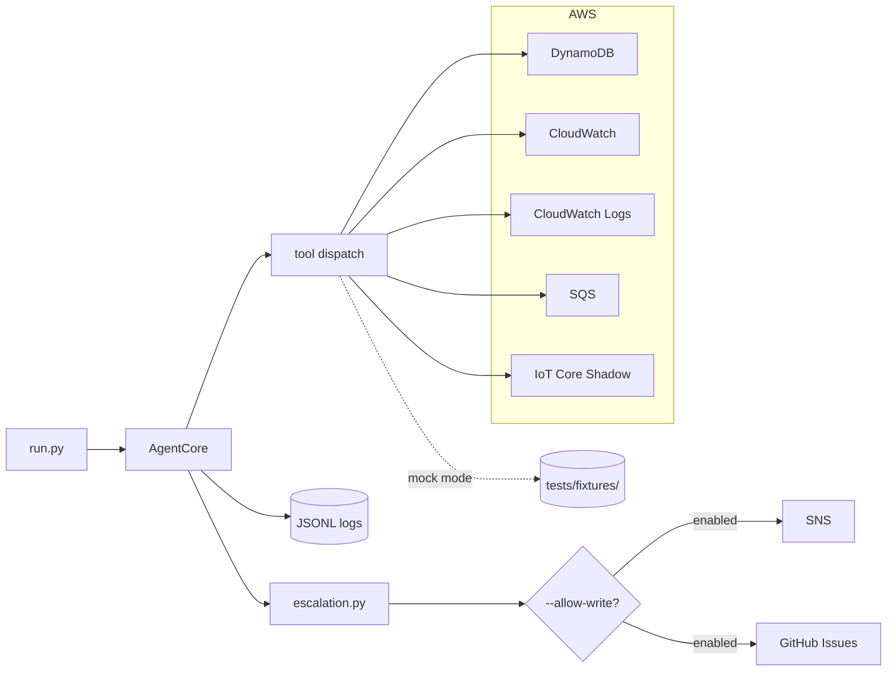

# iot-ops-agent

An autonomous AI agent for IoT cold chain fleet operations. Uses the Anthropic Claude API with tool use to monitor device health, investigate alarms, execute runbooks, and escalate — without a human in the loop.

Built to show how a senior architect thinks about agentic systems: not just that it works, but why it's built the way it is. Every design decision is deliberate and documented.

## What It Does

Three operating modes, one agent loop:

| Mode | Trigger | What it does |
|------|---------|--------------|
| **Watchdog** | Scheduled (e.g. every 15 min) | Full fleet health check. Checks all devices, all alarms, DLQ depth. Produces structured report. |
| **Incident** | CloudWatch alarm fires | Executes a YAML runbook. Gathers evidence, forms hypothesis, assesses confidence, remediates or escalates. |
| **Briefing** | On-demand (ops call, shift handoff) | Concise fleet status for on-call engineer. Prioritized by severity. |

## Running It

```bash
# Install dependencies
python -m venv .venv && source .venv/bin/activate
pip install -r requirements.txt

# Watchdog in mock mode (no AWS credentials needed)
ANTHROPIC_API_KEY=sk-... python run.py --mode watchdog

# Incident responder with a specific runbook
ANTHROPIC_API_KEY=sk-... python run.py --mode incident --runbook temperature_excursion

# Incident with write actions enabled (creates GitHub issues, publishes SNS)
ANTHROPIC_API_KEY=sk-... python run.py --mode incident --runbook device_silence \
  --allow-write --no-mock

# On-demand briefing
ANTHROPIC_API_KEY=sk-... python run.py --mode briefing
```

### Flags

| Flag | Default | Description |
|------|---------|-------------|
| `--mode` | required | `watchdog`, `incident`, or `briefing` |
| `--no-mock` | off (mock on) | Use live AWS instead of fixture data |
| `--allow-write` | off | Enable `create_github_issue` and `publish_sns_escalation` |
| `--config-override PATH` | none | YAML file deep-merged over `config/config.yaml` |
| `--runbook ID` | `temperature_excursion` | Runbook to execute (incident mode only) |
| `--device ID` | none | Target a specific device in incident mode |

## Architecture in Brief



The agent loop is a standard tool-use loop: call Claude, dispatch any tool calls, add results to context, repeat until `end_turn`. What makes it production-ready is what surrounds the loop:

- **Permission enforcement at two layers** — `AgentCore._dispatch_tool()` checks mode allowlists and the write flag before any tool call. Write tools independently check the same flag. Defence in depth, not redundancy.
- **Incremental structured logging** — every event (tool call, tool result, reasoning step, escalation) is written and flushed immediately as JSONL. A crash mid-run leaves a valid partial log.
- **Escalation as a first-class outcome** — `escalation.py` holds all escalation logic. Confidence below threshold or a blocked keyword in the recommended action triggers escalation. Mode files never make this decision.
- **Config as the single source of truth** — all thresholds, tool permissions, and AWS resource names live in `config/config.yaml`. No magic numbers in agent code.
- **Mock mode by default** — the agent runs fully without AWS credentials. Fixture data in `tests/fixtures/` tells a coherent story: truck-002 has an active temperature excursion, truck-003 is silent.

See [`docs/architecture.md`](docs/architecture.md) for the full design rationale.


## Design Decisions

Bounded tool use: The agent must have explicit, declarative tool registry enforced at dispatch rather than giving the LLM open-ended capability. In production, an agent using an inappropriate or unapproved tool can result in incorrect data changes, unexpected security implications, costs, or other customer-facing impact.

Escalation: I treat escalation as a designed control path and not as failure handling. An agent should know when confidence, policy, ambiguity, or risk exceeds its authority and produce a clean handoff with structured context. Without that path, production agents can guess, stall, retry blindly, or lose important uncertainty inside generic error handling.

Structured reasoning logs: I log all agent activity as structured JSONL events. Production behavior needs to be inspectable, replayable, searchable, and attributable across decisions, tool calls, costs, errors, and outcomes. Without structured logs, debugging is messy, an incident review becomes guesswork and operational learning can be missed.

Mock mode by default: I ship the agent with mock_mode: true and require an explicit --no-mock flag before it touches live AWS resources. Real-world side effects should require explicit intent, especially in portfolio code, demos, and early development loops. This keeps iteration safe, prevents accidental cloud changes or spend, and signals the production discipline I would expect in a real customer environment.


## Tool Registry

9 tools across three permission tiers. Read tools are available in most modes; write tools require explicit `--allow-write`:

| Tool | Watchdog | Incident | Briefing | AWS Service |
|------|:--------:|:--------:|:--------:|-------------|
| `get_device_telemetry` | ✓ | ✓ | ✓ | DynamoDB |
| `list_fleet_devices` | ✓ | ✓ | ✓ | DynamoDB |
| `get_excursion_events` | ✓ | ✓ | ✓ | DynamoDB |
| `get_cloudwatch_alarm_state` | ✓ | ✓ | ✓ | CloudWatch |
| `query_cloudwatch_logs` | ✓ | ✓ | ✗ | CloudWatch Logs |
| `get_dlq_depth` | ✓ | ✓ | ✓ | SQS |
| `get_device_shadow` | ✗ | ✓ | ✗ | IoT Core Shadow |
| `create_github_issue` | ✗ | ✓* | ✗ | GitHub API |
| `publish_sns_escalation` | ✗ | ✓* | ✗ | SNS |

`✓*` requires `--allow-write`.

Full schema and fixture details: [`docs/tool-registry.md`](docs/tool-registry.md)

## Runbooks

Runbooks are declarative YAML files in `config/runbooks/`. They define steps, tool hints, hypotheses, and confidence adjustments. The agent reads them as context — it interprets, doesn't execute line-by-line. This means the agent can skip irrelevant steps, combine steps, or surface evidence the runbook didn't anticipate.

Two runbooks included:
- `temperature_excursion.yaml` — 5-step investigation: identify affected devices → excursion history → alarm verification → device shadow → log analysis
- `device_silence.yaml` — 4-step investigation: identify silent devices → device shadow → DLQ check → log analysis

## Tests

```bash
pytest tests/ -v
# 20 tests, zero AWS credentials required, ~0.3s
```

Every tool has at least one test in mock mode. Fixture data is realistic: real temperature ranges, real device IDs, coherent fault scenario across all fixtures. `tests/test_tools.py` is the CI baseline.

## Reasoning Logs

Every run writes a JSONL file to `logs/`. Events:

```
run_start → llm_request → llm_response → tool_call → tool_result → ... → run_end
```

Example `run_end` event:
```json
{
  "type": "run_end",
  "status": "complete",
  "total_input_tokens": 24381,
  "total_output_tokens": 847,
  "tool_calls_made": 14,
  "log_path": "logs/watchdog_20260506T143012Z_a3f8b21c.jsonl",
  "timestamp": "2026-05-06T14:31:48.221Z",
  "run_id": "a3f8b21c"
}
```

The `data_source` field in every tool result shows `"mock"` or the actual AWS service name — making the provenance of every data point visible in the log.

## Stack

- Python 3.11+
- [Anthropic Python SDK](https://github.com/anthropics/anthropic-sdk-python) — `claude-sonnet-4-6` with tool use
- boto3 — DynamoDB, CloudWatch, CloudWatch Logs, SQS, SNS, IoT Core
- PyGithub — GitHub issue creation
- PyYAML — config and runbook loading
- pytest — test suite

## Related Projects

- **[aws-iot-edge-reference](https://github.com/JamesIOmete/aws-iot-edge-reference)** — The AWS IoT stack this agent monitors: Greengrass, IoT Core rules, DynamoDB schema, CloudWatch alarms
- **[iotctl](https://github.com/JamesIOmete/iotctl)** — CLI for fleet management operations (firmware updates, shadow inspection, bulk commands)
- **[tf-plan-ai-reviewer](https://github.com/JamesIOmete/tf-plan-ai-reviewer)** — AI-assisted Terraform plan review for the infrastructure backing this stack
- **[multicloud-sa-toolkit](https://github.com/JamesIOmete/multicloud-sa-toolkit)** — Solutions architect reference patterns across AWS, Azure, and GCP
